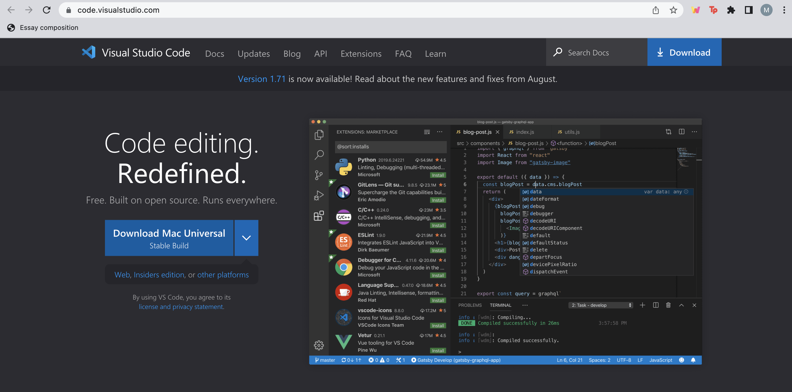
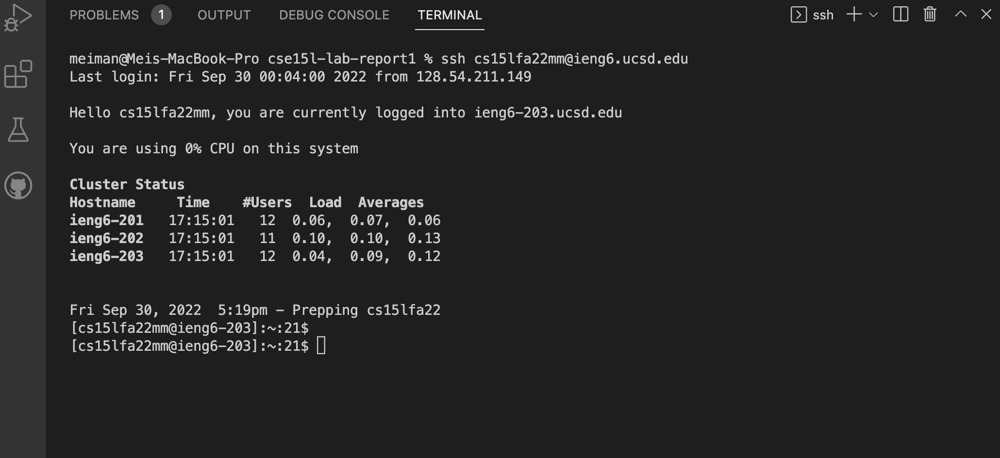
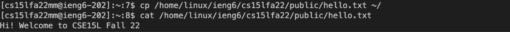
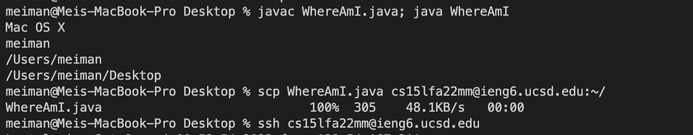
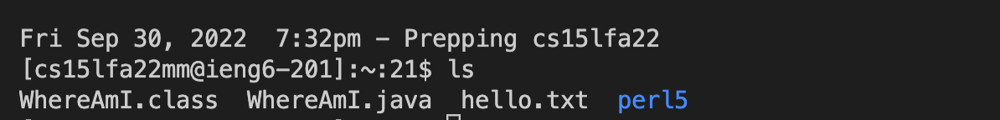
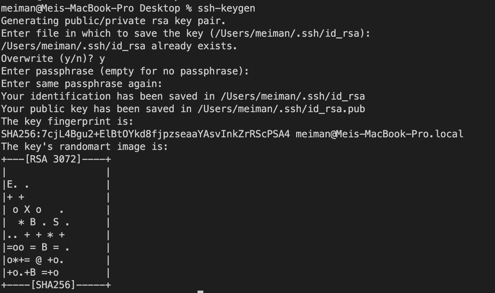
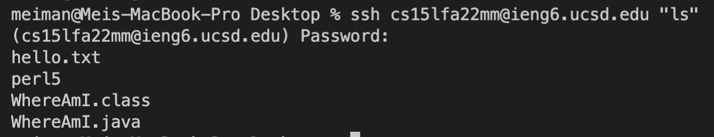
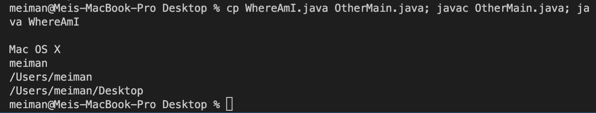

# Lab Report 1: 
## How to log into a course-specific account on ieng6

We might want run commands on another computer from our own. This can be useful when we cannot physically access the other computer or to perform other useful actions like updating several computers at once. 

In order to **log into an account on ieng6**:

1) Install [VScode](https://code.visualstudio.com/) following the instructions on the website for the given operating system. 

2) To connect to a remote host or server, open a new terminal in VScode and write the `ssh` command followed by your course-specific account email address. 

3) Some of the commands often used are the `cp` and `cat` commands. 
   * To copy a file or a directory, simply wirte `cp` and the pathway.
   * To read and print the file to standard output, simply write `cat` and the pathway.

4) To move files over the client to the remote server's directory, we use the `scp` command to copy the file, then write the file we want to copy, followed by the account we want to copy it to.

5) SSH keys can be used to `ssh` or `scp` from the client to the server without entering the password. To do this we must first create a SSH key by: 
   * Writing `ssh-keygen` in the terminal.
   
   * Now, to copy  the public key to the .ssh directory on the server, run `ssh` and the name of the account on the client computer. 
   * Then logout of the server.
   *Back on client, write the following: scp /Users/XX/.ssh/id_rsa.pub cs15lfa22@ieng6.ucsd.edu:~/.ssh/authorized_keys, where XX stands for your username. 

6) A few ways to optimize remote running are:
   *Writing commands in quotes at the end of `ssh` to run it directly on the remote server. The following screenshot shows the logging in command ran and then `ls` in a single line, instead of doing it seperately in two lines:
   
   *Using `;`to run multiple commands on the same line.
   

